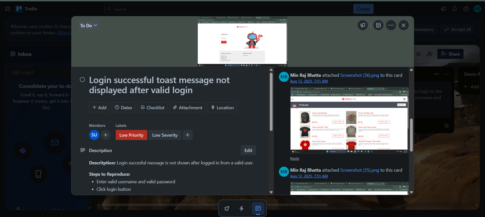

# Bug-Report-in-Trello

## 🐞 Swag Labs Bug Report

This repository documents a bug found in Swag Labs during login testing. The issue has been tracked in Trello and is recorded here for reference, collaboration, and potential fixes.

### Bug Summary

Title: Login successful toast message not displayed after valid login

__Severity__: Low

**Priority**: Low

**Status**: Open

### Description

When a valid user logs in with correct credentials, the system should display a toast message confirming a successful login. However, the message is not displayed, which may lead to confusion for users about whether the login was successful

### Steps to Reproduce

* Navigate to the login page of Swag Labs

* Enter a valid username and valid password

* Click the Login button

* Observe that no toast message appears confirming login

### Expected Behavior

A toast message (e.g., "Login successful") should appear after a successful login attempt.

### Actual Behavior

No toast message is displayed even though the login is successful.

### Screenshots

Bug evidence is attached in the repository under the /screenshots folder.

### Environment

**Application**: Swag Labs

**Browser**: Chrome (latest version at time of test)

**OS**: Windows 11
